<div align="center">

# DevOps Bootcamp Final Project

Infrastructure deployment and configuration automation on AWS using Terraform, Docker, Ansible, Prometheus, Grafana and Cloudflare.

[](https://github.com/aishahzahirun96/devops-bootcamp-project/actions/workflows/pages.yml)

</div>

---

## Project URLs

| Service | URL |
|---|---|
| Web Application | [web.aishahzahirun.asia](https://web.aishahzahirun.asia) |
| Monitoring | [monitoring.aishahzahirun.asia](https://monitoring.aishahzahirun.asia/d/0b705712-09ca-406d-94fd-9cf905ff8390/armada-node-overview?orgId=1&from=now-15m&to=now&timezone=browser&refresh=30s) |
| GitHub Repository | [devops-bootcamp-project](https://github.com/aishahzahirun96/devops-bootcamp-project) |
| Documentation | [README.md](https://readme.aishahzahirun.asia/) |

> The AWS infrastructure must be running for the application and monitoring URLs to remain accessible.

## Project Overview

This project provisions an AWS environment using Terraform and configures its servers using Ansible.

The application is packaged as a Docker image and stored in a private Amazon ECR repository. Prometheus collects metrics from the web server through node_exporter, while Grafana displays the collected metrics. Cloudflare Tunnel provides public access to Grafana without exposing the monitoring server directly to the Internet.

## Architecture

| Component | Configuration |
|---|---|
| AWS Region | `ap-southeast-1` |
| VPC | `devops-vpc` — `10.0.0.0/24` |
| Public Subnet | `10.0.0.0/25` |
| Private Subnet | `10.0.0.128/25` |
| Web Server | `10.0.0.5` |
| Ansible Controller | `10.0.0.135` |
| Monitoring Server | `10.0.0.136` |

### Server Roles

| Server | Network | Role |
|---|---|---|
| Web Server | Public subnet | Runs the application container and node_exporter |
| Ansible Controller | Private subnet | Runs Ansible playbooks |
| Monitoring Server | Private subnet | Runs Prometheus and Grafana containers |

### Traffic Flow

```text
Internet
   │
   ├── web.aishahzahirun.asia
   │       │
   │       ▼
   │   Elastic IP
   │       │
   │       ▼
   │   Web Server :80
   │
   └── monitoring.aishahzahirun.asia
           │
           ▼
      Cloudflare Tunnel
           │
           ▼
       Grafana :3000

Web Server node_exporter :9100
           │
           ▼
Prometheus :9090 → Grafana
```

## Repository Structure

```text
.
├── app/
│   ├── ship/
│   ├── Dockerfile
│   ├── .dockerignore
│   └── nginx.conf
├── terraform/
│   ├── providers.tf
│   ├── network.tf
│   ├── security.tf
│   ├── iam.tf
│   ├── ec2.tf
│   └── outputs.tf
├── ansible/
│   ├── ansible.cfg
│   ├── inventory.ini
│   ├── requirements.yaml
│   ├── site.yaml
│   └── tasks/
│   │   ├── install-docker.yaml
│   │   ├── deploy-app.yaml
│   │   └──  deploy-monitoring.yaml
│   └── files/
│       ├── compose.yml
│       └── prometheus.yaml
├── docs/
│   └── screenshots/
├── .github/
│   └── workflows/
│       └── pages.yml
└── README.md
```

## 1. Infrastructure with Terraform

Terraform provisions:

- One VPC
- One public subnet
- One private subnet
- Internet Gateway
- NAT Gateway
- Public and private route tables
- Public and private security groups
- Three EC2 instances
- Elastic IP for the web server
- IAM instance profiles for AWS Systems Manager
- Private Amazon ECR repository

The Terraform state is stored in the manually created S3 bucket:

```text
devops-bootcamp-terraform-aishah
```

### Terraform Commands

```bash
cd terraform
terraform init
terraform fmt
terraform validate
terraform plan
terraform apply
```

### Infrastructure Evidence


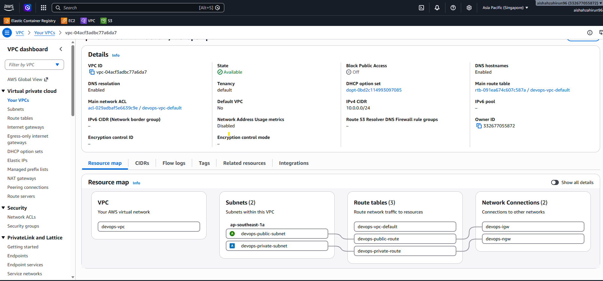
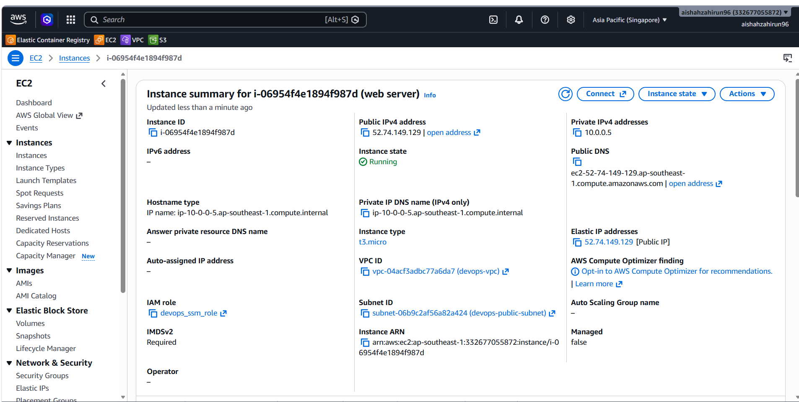
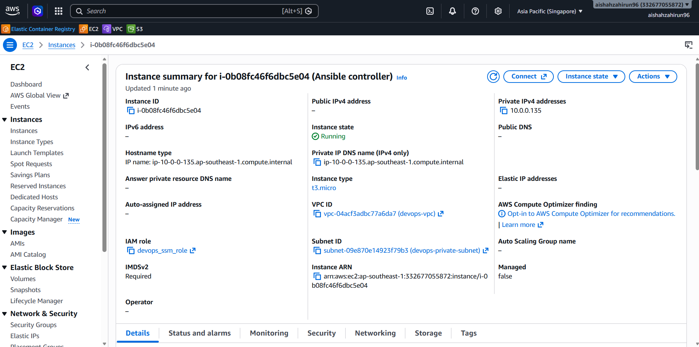
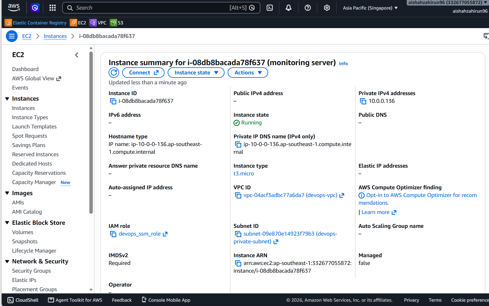
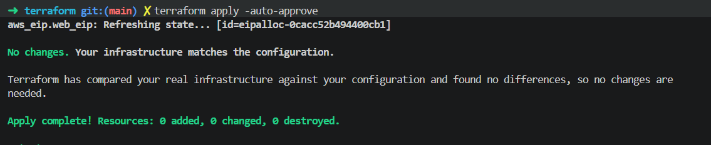
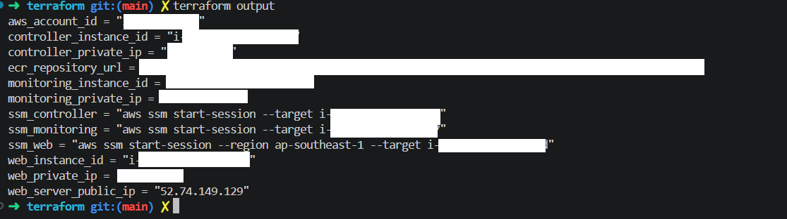

## 2. Docker and Amazon ECR

The application uses a multi-stage Docker build:

1. Node.js builds the Vite application.
2. Nginx serves the generated static files.
3. The image is pushed to the private ECR repository.

ECR repository:

```text
devops-bootcamp/final-project-aishah
```

### Build the Image

```bash
export AWS_REGION=ap-southeast-1

ECR_REPO=$(terraform -chdir=terraform output -raw ecr_repository_url)
ECR_REGISTRY="${ECR_REPO%%/*}"
IMAGE_TAG=v1

aws ecr get-login-password --region "$AWS_REGION" |
  docker login \
    --username AWS \
    --password-stdin "$ECR_REGISTRY"

docker buildx build \
  --platform linux/amd64 \
  --load \
  -t "$ECR_REPO:$IMAGE_TAG" \
  ./app
```

### Test Locally

```bash
docker run --rm -d \
  --name bootcamp-preview \
  -p 8080:80 \
  "$ECR_REPO:$IMAGE_TAG"

curl --fail http://localhost:8080/
```

### Push to ECR

```bash
docker push "$ECR_REPO:$IMAGE_TAG"
```

### Docker and ECR Evidence

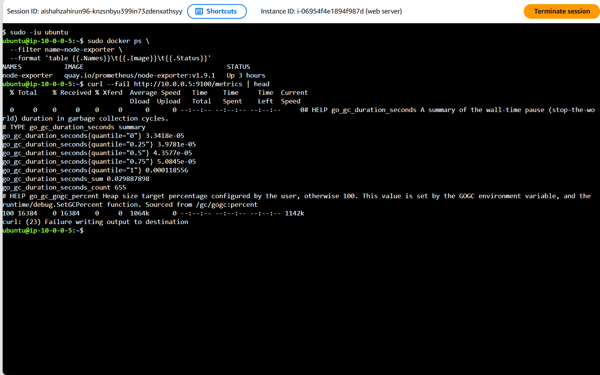
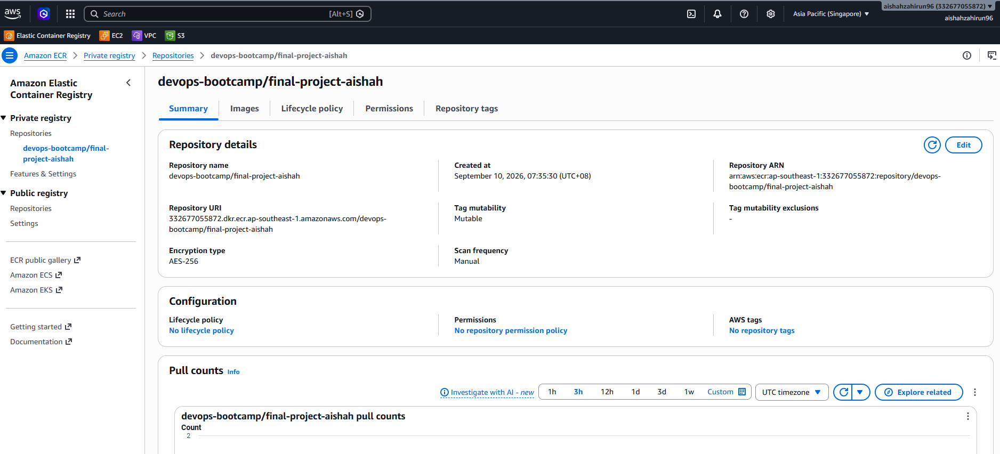
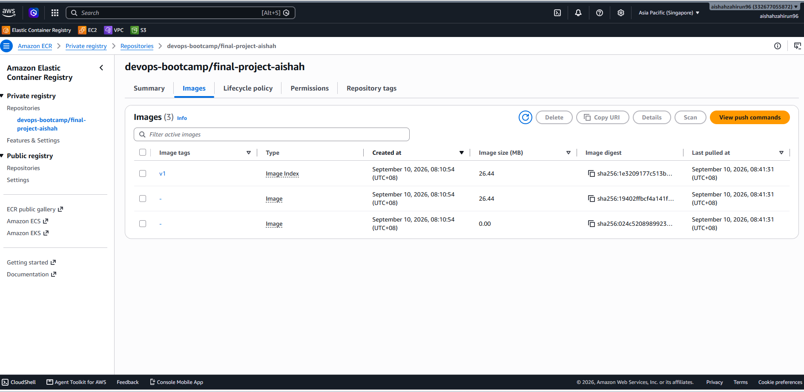

## 3. Configuration with Ansible

Ansible runs from the controller at `10.0.0.135` and manages:

```text
Web server:        10.0.0.5
Monitoring server: 10.0.0.136
```

Docker is installed using the Ansible Galaxy role:

```text
geerlingguy.docker
```

### Install Requirements

```bash
ansible-galaxy role install -r requirements.yml
ansible-galaxy collection install -r requirements.yml
```

### Test Connectivity

```bash
ansible all -m ping
```

### Run All Playbooks

```bash
ansible-playbook site.yml
```

The main playbook runs:

```text
install-docker.yaml
        ↓
deploy-app.yaml
        ↓
deploy-monitoring.yaml
```

Run the playbook a second time to demonstrate that the configuration is repeatable.

### Ansible Evidence

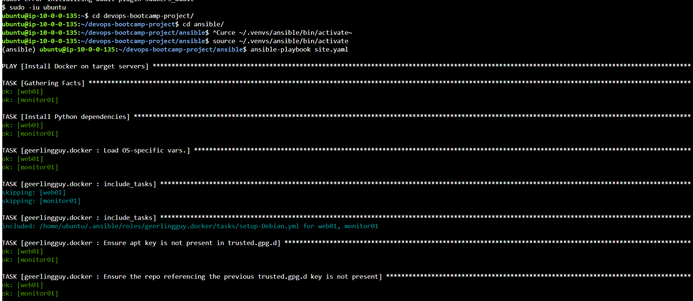
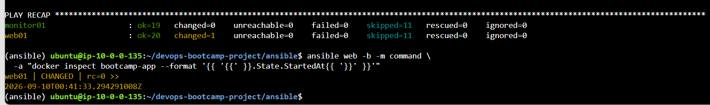

## 4. Monitoring

The monitoring stack runs as Docker containers on the monitoring server:

- Prometheus
- Grafana

The web server runs node_exporter on port `9100`.

```text
node_exporter → Prometheus → Grafana
```

Prometheus scrapes:

```text
10.0.0.5:9100
```

The security group allows port `9100` only from:

```text
10.0.0.136/32
```

### Storage Configuration

Prometheus uses a bind-mounted configuration file:

```text
/opt/monitoring/prometheus.yaml
    →
/etc/prometheus/prometheus.yaml
```

Grafana uses a named Docker volume:

```text
grafana-data
    →
/var/lib/grafana
```

### Verify Containers

```bash
sudo docker compose \
  -f /opt/monitoring/compose.yaml \
  ps
```

### Verify Prometheus Target

```bash
curl --get \
  --data-urlencode 'query=up{job="web-node"}' \
  http://127.0.0.1:9090/api/v1/query
```

A result value of `1` confirms that Prometheus can scrape node_exporter.

### Monitoring Evidence

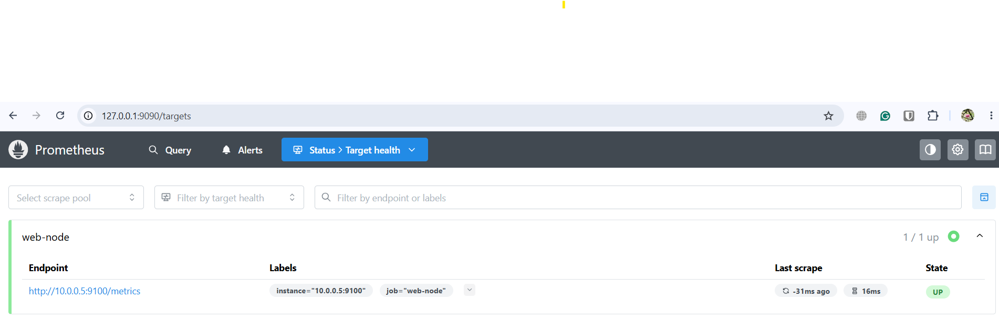
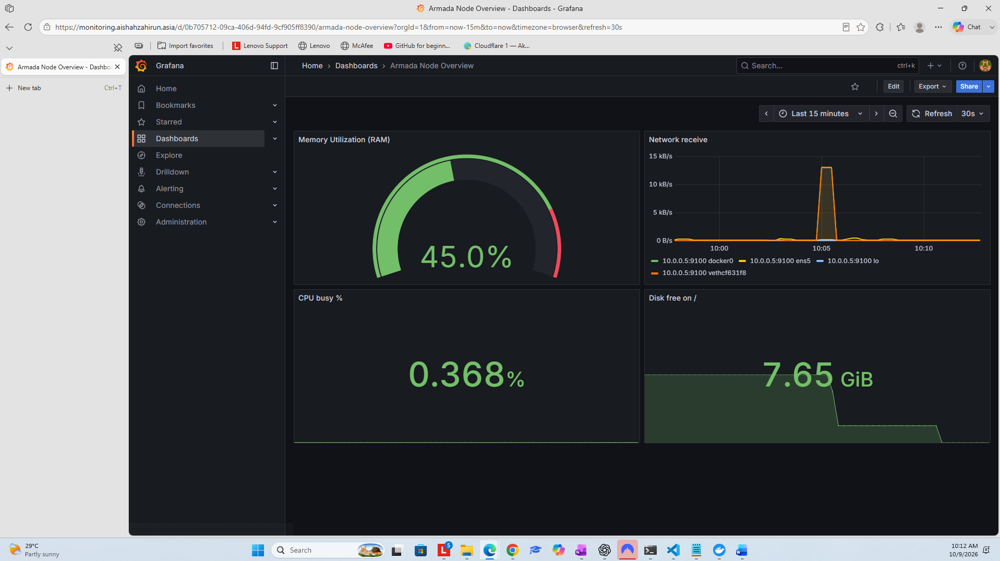
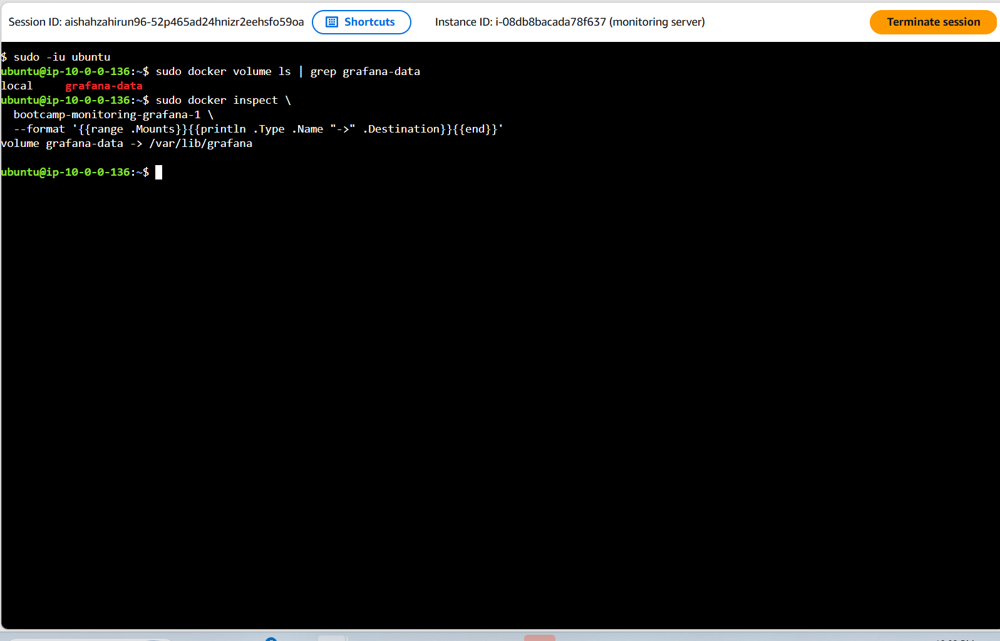

## 5. DNS and Cloudflare

### Web Application

The DNS A record points to the Elastic IP of the web server:

```text
web.aishahzahirun.asia → Web server Elastic IP
```

Port `80` is open to the Internet through `devops-public-sg`.

### Monitoring

Grafana is published using Cloudflare Tunnel:

```text
monitoring.aishahzahirun.asia
        →
http://localhost:3000
```

The monitoring server remains in the private subnet and does not require a public inbound port for Grafana.

### Cloudflare Evidence

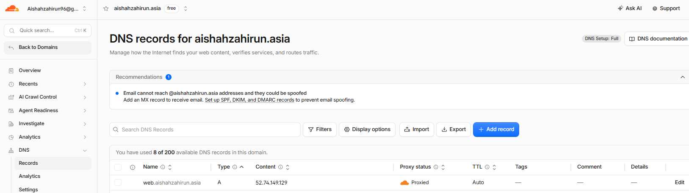
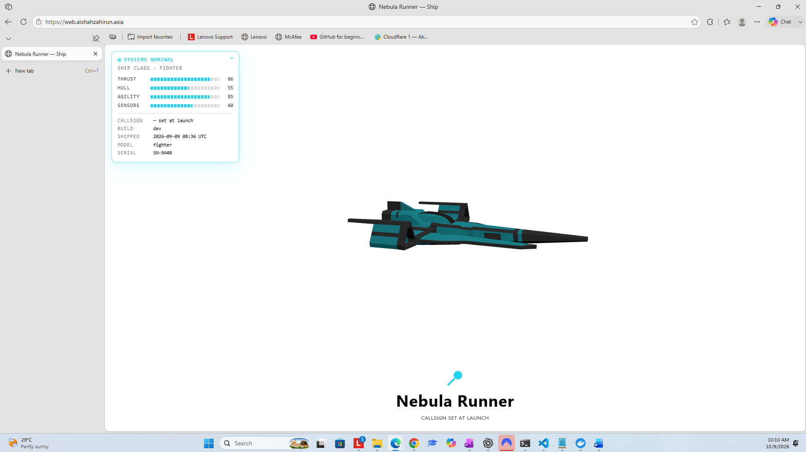
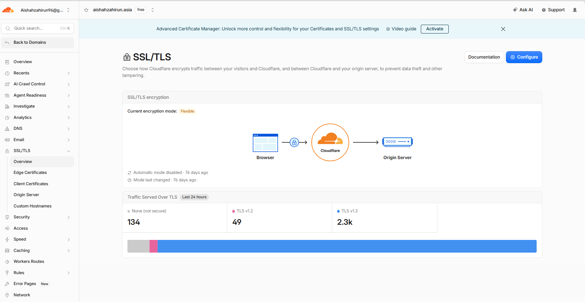
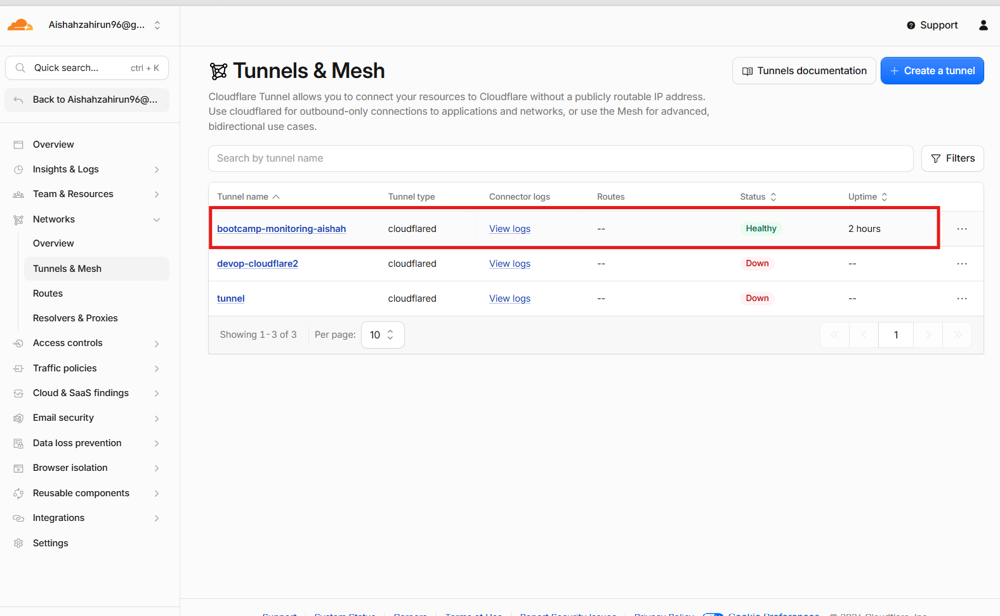
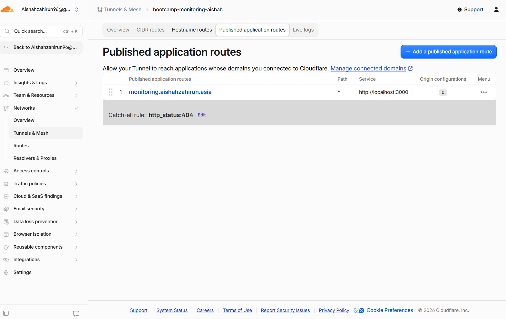
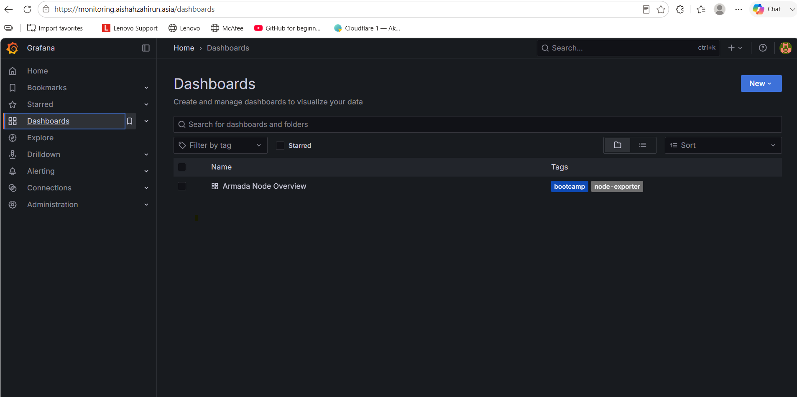

## 6. GitHub Pages

This README is published as a public page using GitHub Actions.

The workflow separates the process into two jobs:

```text
Build README → Deploy GitHub Pages
```

GitHub Pages URL:

```text
https://aishahzahirun96.github.io/devops-bootcamp-project/
```

### GitHub Pages Evidence

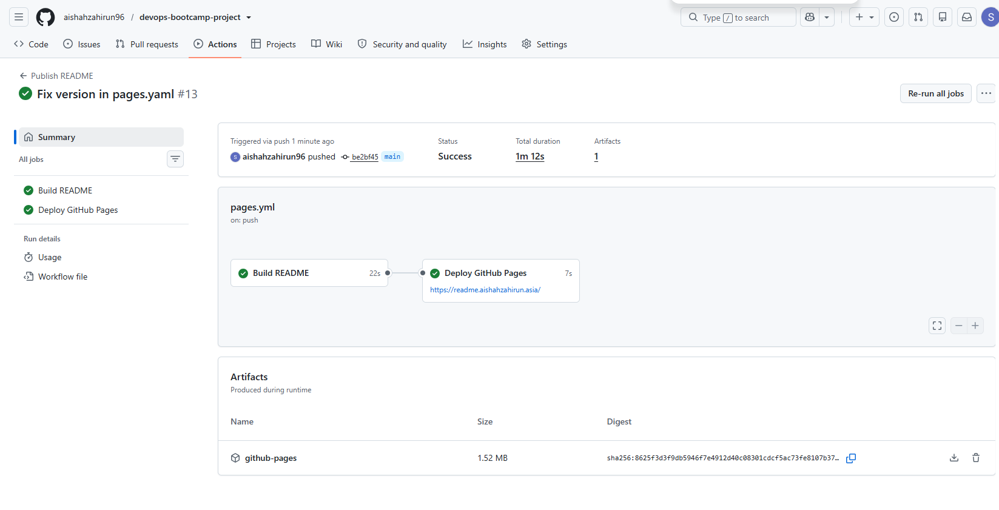

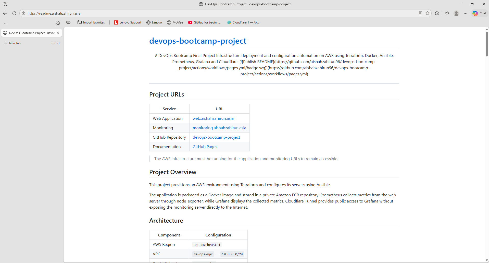

## Security Notes

- AWS credentials are not stored in this repository.
- Cloudflare Tunnel tokens are not committed.
- SSH private keys are excluded from Git.
- Terraform state files are excluded from Git.
- Grafana is exposed through Cloudflare Tunnel.
- The monitoring server has no public IP address.

## Project Status

| Component | Status |
|---|---|
| Terraform infrastructure | Complete |
| Docker image and ECR | Complete |
| Ansible deployment | Complete |
| Prometheus and Grafana | Complete |
| Cloudflare DNS and Tunnel | Complete |
| GitHub Pages | Complete |

---

<div align="center">

Built for the DevOps Bootcamp Final Project.

</div>
